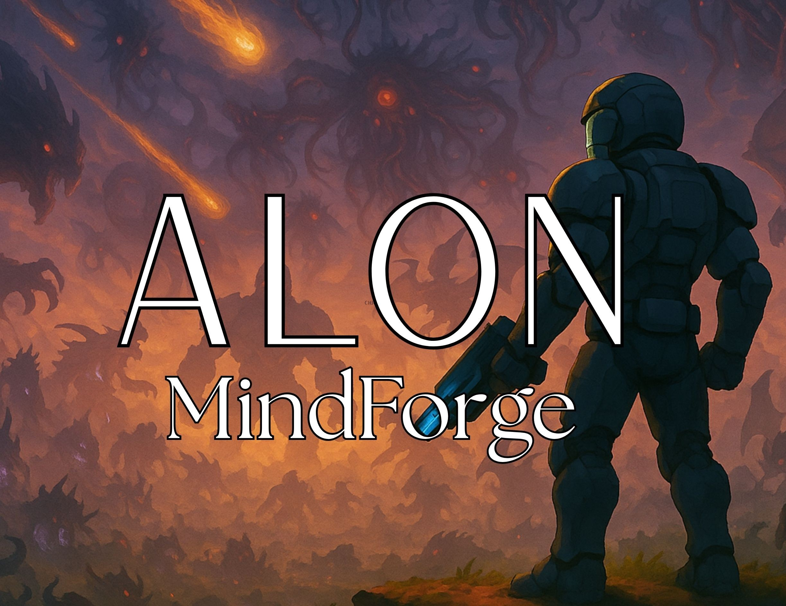

  

  

---

## 💻 Sobre Mim

  

  
Olá! 👋 Sou **Leonardo Martins**, um desenvolvedor **Full Stack** apaixonado por criar soluções digitais inovadoras e eficientes. 

Atualmente, dedico-me ao desenvolvimento de aplicações web modernas, utilizando as melhores práticas e tecnologias do mercado. Além disso, sou um entusiasta da área de **Game Development** 🎮, onde transformo ideias criativas em experiências interativas e envolventes.

Minha paixão por tecnologia me motiva a estar sempre aprendendo e explorando novas ferramentas, frameworks e metodologias. Acredito que código limpo, bem estruturado e eficiente é a base para construir soluções que realmente fazem a diferença.

---

## 🎮 Meus Jogos

---

## 🚀 Tecnologias & Ferramentas

  
  
  
  
  
  
  
  
  
  
  
  
  

---

## 📊 Estatísticas do GitHub

  
  
  

  
  
  

  
  
  

---

## 🎯 Contribuições

  
  
  

---

## 🌐 Conecte-se Comigo

  
  
  
  
  
  
  
  
  

---

  
  
Se você gostou do meu perfil, considere dar uma estrela nos meus repositórios!

  
  

